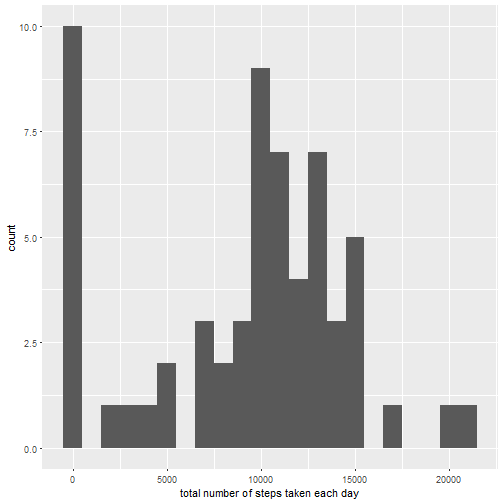

#ACTIVITY_DATA PROJECT1
=====================================
##LOADING AND PREPROCESSING THE DATA

```r
unzip(zipfile="activity.zip")
```

```
## Warning in unzip(zipfile = "activity.zip"): error 1 in extracting from zip
## file
```

```r
data <- read.csv("activity.csv")
```
##THE MEAN AND THE MEDIAN OF THE TOTAL STEPS TAKEN PER DAY
Using ggplot package

```r
library(ggplot2)
total.steps <- tapply(data$steps, data$date, FUN=sum, na.rm=TRUE)
qplot(total.steps, binwidth=1000, xlab="total number of steps taken each day")
```



```r
mean(total.steps, na.rm=TRUE)
```

```
## [1] 9354.23
```

```r
median(total.steps, na.rm=TRUE)
```

```
## [1] 10395
```
##THE AVERAGE DAILY ACTIVITY PATTERN

```r
averages <- aggregate(x=list(steps=data$steps), by=list(interval=data$interval),
                      FUN=mean, na.rm=TRUE)
ggplot(data=averages, aes(x=interval, y=steps)) +
        geom_line() +
        xlab("5-minute interval") +
        ylab("average number of steps taken")
```


The 5 min interval which contains the maximum number of steps is:

```r
averages[which.max(averages$steps),]
```

```
##     interval    steps
## 104      835 206.1698
```
##IMPUTING MISSING DATA
Presence of miising data may introduce a bias in calculations

```r
missing <- is.na(data$steps)
```
How many are missing?

```r
table(missing)
```

```
## missing
## FALSE  TRUE 
## 15264  2304
```
##METHOD USED TO IMPUTE MISSING VALUES
The mean value of its five minute interval is taken.

```r
fill.value <- function(steps, interval) {
        filled <- NA
        if (!is.na(steps))
                filled <- c(steps)
        else
                filled <- (averages[averages$interval==interval, "steps"])
        return(filled)
}
filled.data <- data
filled.data$steps <- mapply(fill.value, filled.data$steps, filled.data$interval)
```
Now using this method we plot the histogram after **imputing** the missing values.
Again the mean and the median is displayed for inference.

```r
total.steps <- tapply(filled.data$steps, filled.data$date, FUN=sum)
qplot(total.steps, binwidth=1000, xlab="total number of steps taken each day")
```


```r
mean(total.steps)
```

```
## [1] 10766.19
```

```r
median(total.steps)
```

```
## [1] 10766.19
```
#DIFFERENCE IN THE WEEKDAY AND WEEKEND STEPS TAKEN PER INETREVAL MENTIONED
The dataset with filled in values or imputed values is used.For this a function is defined which is **weekday.or.weekend**

```r
weekday.or.weekend <- function(date) {
        day <- weekdays(date)
        if (day %in% c("Monday", "Tuesday", "Wednesday", "Thursday", "Friday"))
                return("weekday")
        else if (day %in% c("Saturday", "Sunday"))
                return("weekend")
        else
                stop("invalid date")
}
filled.data$date <- as.Date(filled.data$date)
filled.data$day <- sapply(filled.data$date, FUN=weekday.or.weekend)
```
Now lets create a panel plot to visualize the data better

```r
averages <- aggregate(steps ~ interval + day, data=filled.data, mean)
ggplot(averages, aes(interval, steps)) + geom_line() + facet_grid(day ~ .) +
xlab("5-minute interval") + ylab("Number of steps")
```


